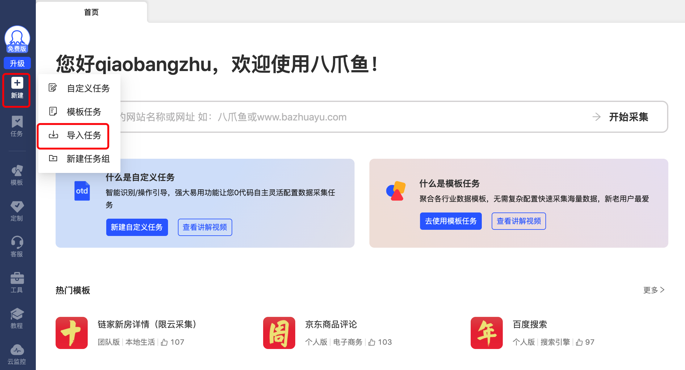
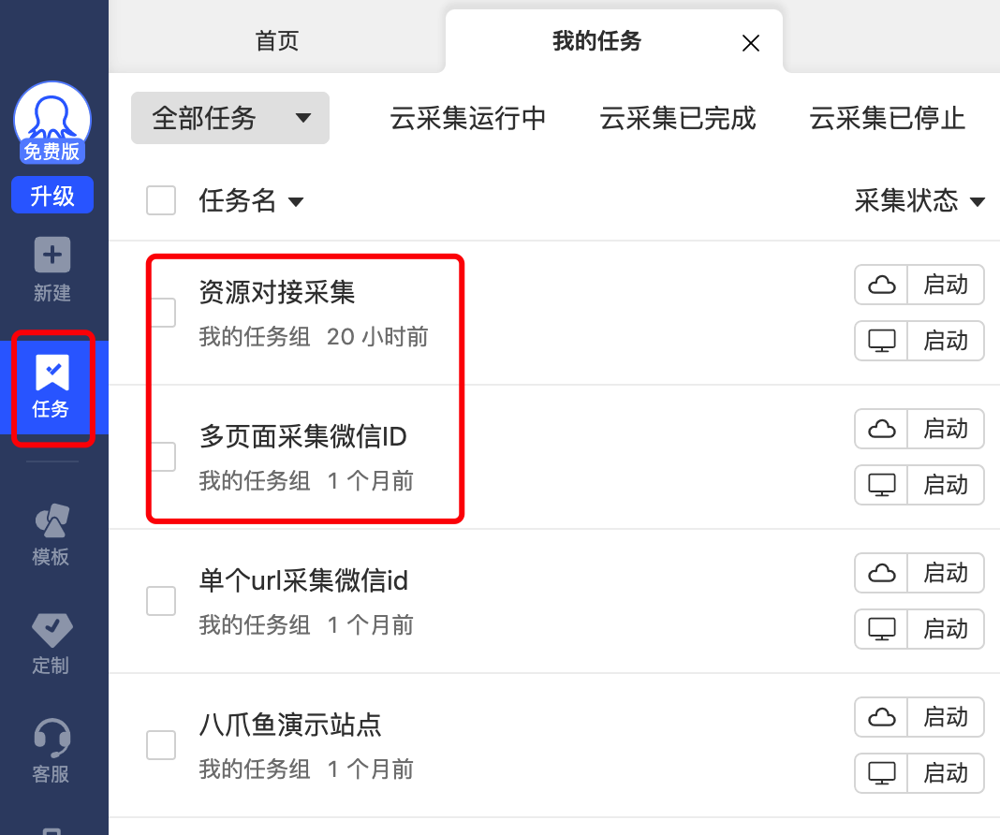

# 1、说明
八爪鱼任务配置，采集知识星球的微信号。

对采集的Excel结果，用Python进行数据的清洗和合并。

# 2、声明

社群内部一般都是禁止批量添加好友，主要为了保障圈友的使用质量和体验，避免被过多的打扰等，大家需要自觉遵守对应社群规范。

本脚本任务从技术角度研究探讨自动添加的可行性，提供给大家一个技术主动引流的解决方案作为学习参考。请勿拿来做些骚扰用户的敏感操作，所产生的相应后果自行承担，均与本作者无关。

# 3、功能目录说明
生财有术 ： 抓取生财有术知识星球网页内容中包含微信的八爪鱼任务脚本

淘金之路 ： 抓取淘金之路知识星球网页内容中包含微信的八爪鱼任务脚本

MyPy ： Python脚本，对八爪鱼抓取的Excel结果做去重合并，并对一些非微信号的内容做清洗

# 4、部署说明
## 4.1、八爪鱼导入任务
在八爪鱼选择“新建 > 导入任务” 导入我们已经配置好的任务:

然后在“任务” 中找到导入的两个任务运行即可:

## 4.2、Python配置
MyPy 为Python脚本，我这边的本地运行环境为Pycharm 2022版本，Python为3.7.4版本，另外需要安装Excel、Pdf的依赖包。

相应的环境配置参考链接如下：

Pycharm注册码：
https://www.exception.site/essay/how-to-free-use-pycharm-2020

Pycharm配置：
https://zhuanlan.zhihu.com/p/26066151

Pycharm配置python环境：
https://jingyan.baidu.com/article/e75057f21d6cd1aac81a8934.html

Python操作Excel：
https://zhuanlan.zhihu.com/p/259583430

Python读取pdf内容：
https://blog.csdn.net/u013236891/article/details/120990346

# 5、详细实践内容参考

<a href="https://w91h2gmtrn.feishu.cn/docx/NjMpdivcZoCihIxrhxgcbwUrnYg" target="_blank">重点参考：《每天稳定新增150+好友，用技术让私域流量实现主动引流》</a>

**内容目录：**
>1、私域主动添加，一个被大家容易忽视的引流方式  
>2、常见主动添加的5个业务场景  
>&nbsp;&nbsp;&nbsp;&nbsp;2.1、同城门店老板主动引流     
>&nbsp;&nbsp;&nbsp;&nbsp;2.2、抖音主播/创业粉主动引流  
>&nbsp;&nbsp;&nbsp;&nbsp;2.3、知识星球社群内引流（不推荐）  
>&nbsp;&nbsp;&nbsp;&nbsp;2.4、投资机构主动引流  
>&nbsp;&nbsp;&nbsp;&nbsp;2.5、各种微信群主动引流  
>&nbsp;&nbsp;&nbsp;&nbsp;2.6、总结  
>3、微信号采集（爬虫）技术的选型  
>4、怎么把微信号给过滤筛选出来？  
>&nbsp;&nbsp;&nbsp;&nbsp;4.1、微信号筛选匹配原理  
>&nbsp;&nbsp;&nbsp;&nbsp;4.2、脏数据匹配清洗  
>&nbsp;&nbsp;&nbsp;&nbsp;4.3、八爪鱼数据格式化配置  
>&nbsp;&nbsp;&nbsp;&nbsp;4.4、导出Excel结果  
>&nbsp;&nbsp;&nbsp;&nbsp;4.5、用Python对结果进一步清洗  
>5、微信号批量添加的技术选型  
>&nbsp;&nbsp;&nbsp;&nbsp;5.1、技术的选择和调研  
>&nbsp;&nbsp;&nbsp;&nbsp;5.2、自动添加的MVP测试  
>&nbsp;&nbsp;&nbsp;&nbsp;5.3、压测及稳定性相关问题  
>&nbsp;&nbsp;&nbsp;&nbsp;5.4、关于微信养号  
>&nbsp;&nbsp;&nbsp;&nbsp;5.5、总结
>6、圈友问题&解答汇总
>&nbsp;&nbsp;&nbsp;&nbsp;6.1、关于抓取老板微信实践补充  
>&nbsp;&nbsp;&nbsp;&nbsp;6.2、关于手机号没有注册微信的问题  
>&nbsp;&nbsp;&nbsp;&nbsp;6.3、关于微信风控问题  
>&nbsp;&nbsp;&nbsp;&nbsp;6.4、关于引流后的操作问题  
>&nbsp;&nbsp;&nbsp;&nbsp;6.5、关于产品的问题  

#	5、更多交流

微信扫码点击关注“点金乔帮主”，领取大礼包福利：《点金工具箱|全网最全的搞钱工具箱》和《技术赚钱实践指南：实现财务自由》

  
